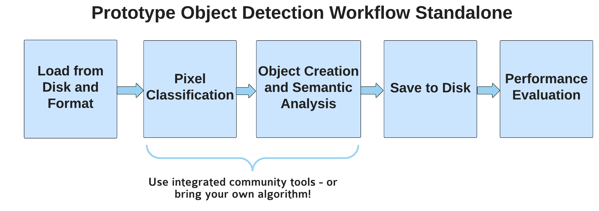
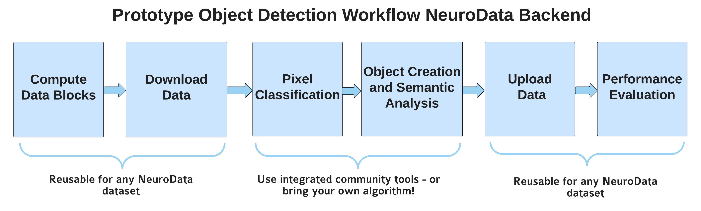

# Mouse Brain Cell Detection Pipeline Deliverable

**January 15, 2016**

*JHU/Applied Physics Laboratory Technical Report and Readme*

To enable the detection of cell clusters at scale, we have developed a generalizable, open source pipelining framework.  This framework leverages several community tools to efficiently and effectively provide scientific tools.

Future work is needed to generate expert dense ground truth labels for training, evaluation and test.  Additionally, work is needed to estimate cell counts in each cell cluster.  This may be accomplished through a regression problem, superpixelization, or simply counting based on estimated cell sizes.  We provide some experimental suggestions below in the post-processing section.  

Due to the limited ground truth available at this time, the focus of the code as of this writing is on providing capability, rather than performance, although we have made a best effort to provide a method and assessment for these tools.  

## Data Input/Output

The code delivered in this package is designed to work in a standalone mode to enable maximum compatibility across different workstation and cluster environments, with a minimum of dependencies.  The first and last steps of our proposed pipeline get and put data respectively.  Interfaces are optionally provided to standard NeuroData tools, which may be leveraged as desired at a future time.

- Data Input
- Data Output

## Manual Annotation for Open Science

### Manno

Prior to training a classifier, dense ground truth is needed.  We provide a tool called manno [[XXLINKXX]] to annotate ground truth.  This interfaces with ITK-Snap and a well-defined protocol that has been used for many neuroimaging tasks.

[[XXBRIEF DESCRIPTION XX]]

Interfaces to other tools

## Machine Annotation for Open Science (Pixel Classification)

### Basic Thresholding

### Ilastik

### Deep Learning

## Post Processing (Object Detection)

- Cell clusters
- Centroids and Size Metrics
 
### Assessment

- Accuracy
- Precision-Recall

## End-to-End Framework

- LONI
- Scriptable Format

## Outlook
