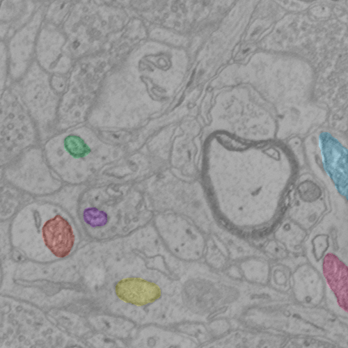

Basic Usage
***********

Protocol
--------

- Identify a region of interest in OCP, and note the data server, token, channel, resolution, and coordinates
- Create a query, using the instructions for CAJAL
- Run *manno_getImage.m* to generate an image volume suitable for annotation in ITK Snap
- Annotate: Once the data has been formatted for ITK Snap, the user should open the ITK SNAP application and load in the NIFTI data saved during the data acquisition step. Then using the brush tool, annotate the data as desired. Users can choose to use separate colors for each annotation or rely on a connected component post-processing step to identify each object (best for sparse data)
- Save Segmentation Image: (ITK Snap Menu > Segmentation > Save Segmentation Image). Choose a name that you will be able to easily correlate to its appropriate volume image volume.
- Run *manno_putAnno.m*, specifying the server, token, annotation file, and query used to download the underlying image. Users may choose to run a simple connected component post-processing step to break each group of connected pixels (3D) into a separate ID. More complicated post-processing should be done outside of the tool, with the result uploaded using the ocp_upload_dense.m function (see CAJAL documentation).

Usage Notes
-----------

- For more information on painting annotations, please follow the steps outlined `here <http://www.itksnap.org/pmwiki/pmwiki.php?n=Documentation.TutorialSectionManualSegmentation>`_.
- Currently, only single channel 8-bit image data is supported
- ITK-Snap is compatible with a variety of input data formats; the most straightforward is NIFTI, a general purpose neuroimaging format. On laptops or smaller workstations, only a small portion of a slice/volume should be truthed at a time for memory reasons.
- *run_manno_example.m* provides a minimal working example to use as a starting point.

Example
-------

The following code demonstrates the manno protocol.  A few mitochondria have been labeled as an example.  The example script should take approximately 10 seconds to complete.

.. code-block:: bash

  function run_manno_example()
  % Manno Example
  % manno starter to demonstrate protocol functionality.  All required inputs
  % are hardcoded for this demo.  Paths are hardcoded for Linux/Mac.
  %
  % This example should be run from the code directory because of the
  % relative paths

  xstart = 5472;
  xstop = xstart + 512;
  ystart = 8712;
  ystop = ystart + 512;
  zstart = 1020;
  zstop = zstart + 16;

  resolution = 1;

  query = OCPQuery;
  query.setType(eOCPQueryType.imageDense);
  query.setCutoutArgs([xstart, xstop],[ystart,ystop],[zstart,zstop],resolution);

  save('../data/queryFileTest.mat','query')
  %% Servers and tokens - alter appropriately
  server = 'openconnecto.me';
  token = 'kasthuri11cc';
  channel = 'image';
  serverUp = 'openconnecto.me';
  tokenUp = 'manno';
  channelUp = 'mito';
  %% Run manno
  manno_getImage(server,token,channel,'../data/queryFileTest','../data/testitk.nii',0)

  % Manual annotation step happens here
  manno_putAnno(serverUp,tokenUp,channelUp,'../data/queryFileTest','../data/mito_seg_example.nii.gz','RAMONOrganelle', 1,0)

Validation
----------

The result of the example script can be accessed using this `link <http://openconnecto.me/ocp/overlay/0.6/openconnecto.me/kasthuri11cc/image/openconnecto.me/manno/mito/xy/1/5472,5972/8712,9212/1031/>`_.

Note that the server and token pair listed here are public but read-only and other data may be pre-existing.  Please create your own projects for testing and annotating!

Notes
-----

Currently, manno only supports 8-bit image data as input, and 32-bit annotation data as output.  If your data is another type (e.g., RGB32), please follow these steps to get your data into a NIFTI file.
Once your data is in a NIFTI format, you can seamlessly use the rest of the protocol (annotation and upload).  We will be making additional enhancements to simplify this process in the coming months.

- Get an HDF5 cutout of your data, following the instructions here:  http://docs.neurodata.io/open-connectome/api/data_api.html#get
- Open your hdf5 file in matlab.  This can typically be accomplished with the following command:  `im = h5read(<path to data>, '/default/CUTOUT')`
- If you have difficulty with this step, try viewing the structure of your data using `HDFView <https://www.hdfgroup.org/products/java/hdfview/>`_, a free cross-platform tool.
- Next save your nifti data:

.. code-block:: bash

  nii = make_nii(im);
  save_nii(nii, fileOut);

- And finally be sure to manually create and save your query using the instructions provided in CAJAL (or the demo script):

.. code-block:: bash

  query = OCPQuery;
  query.setType(eOCPQueryType.imageDense);
  query.setCutoutArgs([xstart, xstop],[ystart,ystop],[zstart,zstop],resolution);
